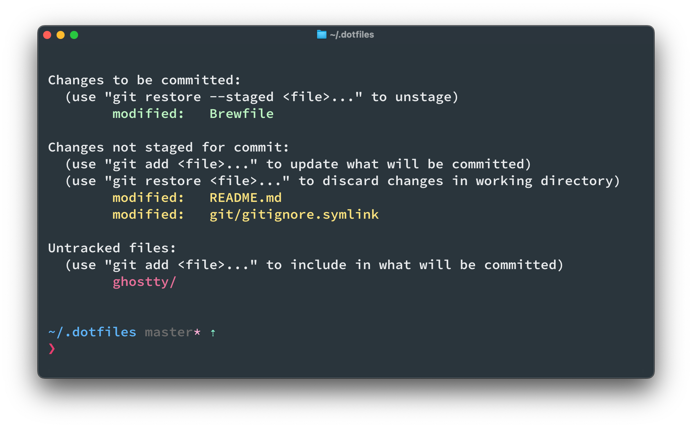

# eexit dotfiles

Forked from https://github.com/holman/dotfiles.
Cleaned and fed up to fit my needs.



## install

Run this:

```sh
git clone https://github.com/eexit/dotfiles.git ~/.dotfiles
cd ~/.dotfiles
script/bootstrap
```

