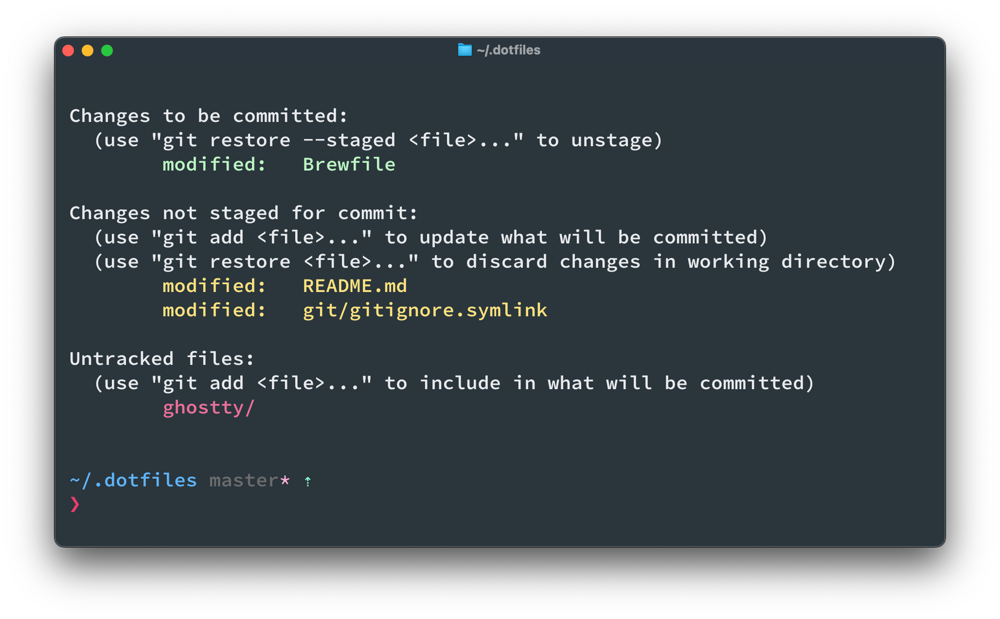

# eexit dotfiles

Forked from https://github.com/holman/dotfiles.
Cleaned and fed up to fit my needs.



## Installation

Make sure you already use ZSH, otherwise:

```bash
chsh -s $(which zsh) && exit
```

1. Install [Homebrew](https://brew.sh) and 
2. [Generate](https://docs.github.com/en/authentication/connecting-to-github-with-ssh/generating-a-new-ssh-key-and-adding-it-to-the-ssh-agent) and [add a new SSH key to your GitHub account](https://docs.github.com/en/authentication/connecting-to-github-with-ssh/adding-a-new-ssh-key-to-your-github-account)
3. Add the composer token: ` composer config --global github-oauth.github.com {token}`

```bash
git clone https://github.com/eexit/dotfiles.git ~/.dotfiles
cd ~/.dotfiles
script/bootstrap
```

## Things you don't want to share

Put any env variables, Github token env vars, etc. in `~/.localrc` and any other script sourcing that you won't share in `~/.extrarc`.

## SSH Config

The SSH configuration should be as following:

```bash
chmod 600 ~/.ssh/*
chmod 700 ~/.ssh ~/.ssh/known_hosts ~/.ssh/cm_socket
chmod 644 ~/.ssh/*.pub
```
